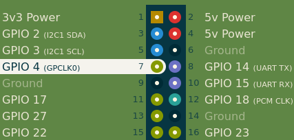
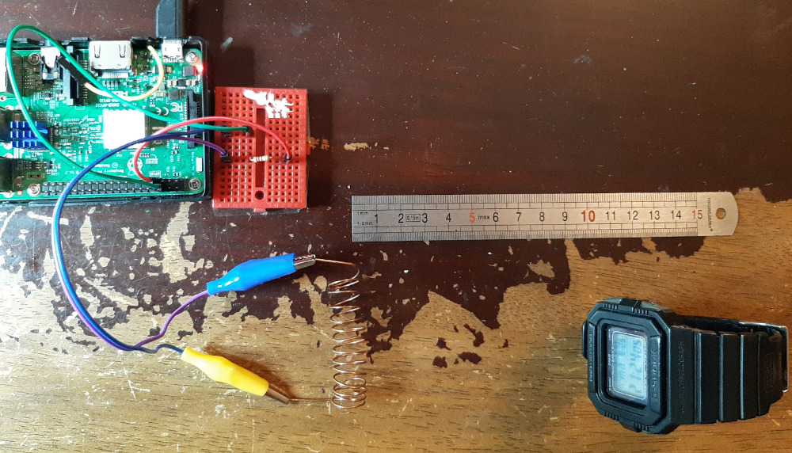
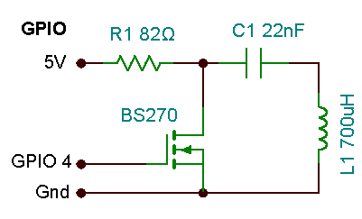
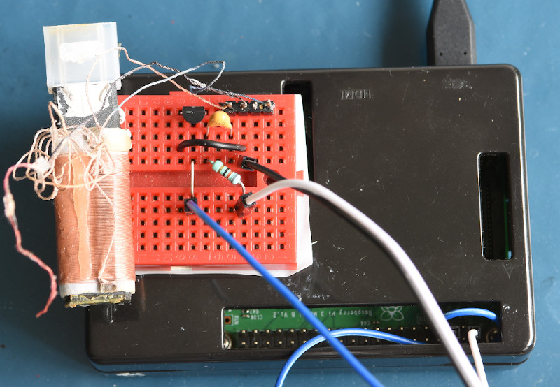
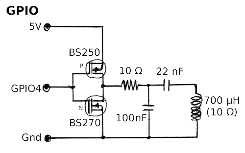
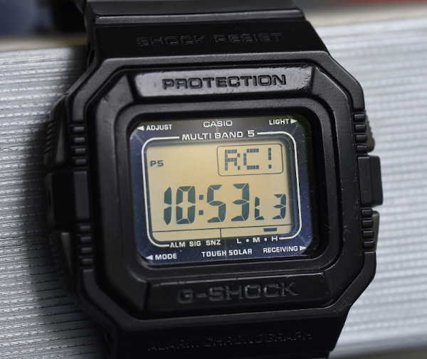
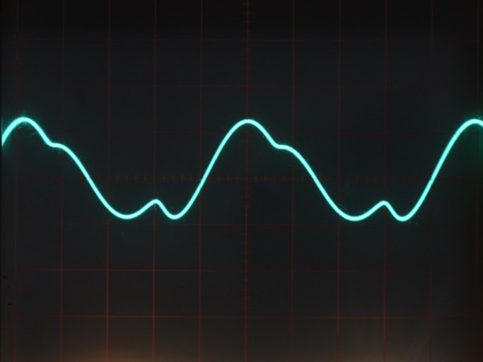
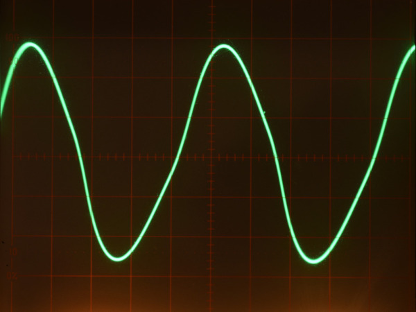

# time-signal
A fork of [Pierre Brial's time-signal](https://github.com/harlock974/time-signal) with additional features added.

**time-signal** allows a Raspberry Pi to become a DCF77, JJY, MSF, or WWVB simulator/transmitter.

Notable new features include:
* Automatically getting clock frequencies from system kernel.
* User entered time offset for transmitted time signal.
* Ability to install as a service to run on boot.
* [Full Technical Differences](#credits-and-References)

## Platforms

**time-signal** has been successfully tested on:
* Raspberry Pi 1 Model B+ Rev 1.2
* Raspberry Pi 2 Model B Rev 1.1
* Raspberry Pi 3 Model B Rev 1.2
* Raspberry Pi 3 Model B+
* Raspberry Pi 4 Model B
* Raspberry Pi Zero W
* Raspberry Pi Zero 2 W

## Build and Install

To build **time-signal**, clone this repository and run `make` using the example below:
```
$ git clone https://github.com/steve1515/time-signal
$ cd time-signal
$ make
$ ./build/time-signal -h
```

To install **time-signal** so it runs automatically on boot, execute the following command after editing `time-signal.service` to contain your required service options. Example: `-s WWVB`
```
$ sudo make install
```

Note: Use `sudo make uninstall` to uninstall the program.

## Usage

```
sudo ./time-signal [options]
```

### Options

`-s <service>` : Time service to transmit.
* `<service>` is one of `DCF77`, `JJY40`, `JJY60`, `MSF`, or `WWVB`. Example: `-s DCF77`

`-c` : Output carrier wave only without time signal. Useful for testing frequencies.

`-o <hours>` : Offset the time signal transmitted by the value given in `<hours>`.

`-v` : Verbose. Add this option multiple times for more verbosity.
* `-v` to output time every minute
* `-vv` to additionally output modulation values

`-h` : Print this options help message.

## Hardware

### Circuits

**time-signal** uses a 5V power pin, a Ground pin and GPIO 4 (Pin 7) to transmit the modulated carrier wave.

\
_[Raspberry Pi Pinout](https://pinout.xyz)_

The simplest hardware you can use to transmit the signal is to connect a coil and a 220Ω resistor in series between GPIO4 and a ground pin:



With a 60cm wire and 14 turns of 13mm diameter, the range is quite decent: 10cm for DCF77 and 45cm for JJY at 40 kHz.

For a longer range and still simple circuit, you can use a ferrite antenna salvaged from an AM receiver with an N-channel MOSFET as an amplifier. You will then have these three components plus antenna circuit:





If you don't have a MOSFET, you can instead use an NPN transistor with a 4.7kΩ resistor between its base and GPIO4.

C1 capacitor value depends on antenna inductance and target frequency (see below).

As small MOSFETs like the BS270 can handle up to 250 mA, you can design a more powerful transmitter with two complementary MOSFETs as a NOT gate and a lower value resistor:



These circuits have been successfully tested with DCF77, JJY40 and WWVB signals. A range of ten meters was reached with JJY40 and the dual MOSFET configuration.

\
_G-Shock Watch with Strong Reception (L3)_

### Antennas

There is much concern in radio communities about the strength of the signal related to legal limits. But, with low frequencies, it is very difficult to design a long range transmitting antenna:

_"The problem of designing compact, efficient, and broadband antennas capable of transmitting signals in the very low frequency (VLF, 3-30 kHz) and low frequency (LF, 30-300 kHz) bands has plagued engineers for decades [...] For instance, attempting to build a standard quarter-wave monopole at 30 kHz would require an antenna to be 2.5 km long, which is roughly three times longer than the tallest building on Earth."_[^1]

For example, the [Ohtakadoyayama Station](https://jjy.nict.go.jp/jjy/trans/index-e.html) antenna transmitting the JJY 40 kHz signal is an umbrella type 250m high, and the [Mainflingen Station](https://www.ptb.de/cms/en/ptb/fachabteilungen/abt4/fb-44/ag-442/dissemination-of-legal-time/dcf77/dcf77-transmitting-facilities.html) transmitting DCF77 at 77.5 kHz is a T-type 150m high.

Therefore, building an efficient transmitting antenna is far beyond practical limits for the hobbyist. The solution here is to use a compact ferrite rod antenna. These can be salvaged from an AM radio or from a cheap DCF77 module. _"Ferrite rod antennas are normally only used for receiving. They are rarely used for transmitting anything above low levels of power in view of their poor efficiency. They can be used as a very compact form of transmitting antenna for applications where efficiency is not an issue and where power levels are very low. If power levels rise too high then heat dissipation in the ferrite becomes an issue."_[^2]

Hence don't expect to transmit outside your house. The longest range these circuits succeeded to reach was 10 meters with a 40 kHz signal and direct line of sight. The antenna was powered by the 5 volt dual MOSFET amplifier circuit. Increasing the voltage didn't improve the range.

You will have to adjust the resonance of your antenna for the desired frequency with the capacitor. Capacitor value depends on antenna inductance L and target frequency f:
```math
C = \frac{1}{4\pi^2 \cdot L \cdot f^2}
```

AM antennas have usually an inductance between 500 and 700 µH, so the theoretical C values are:
* 40000 Hz : 26 nF
* 60000 Hz : 12 nF
* 77500 Hz : 7 nF

If you have an oscilloscope, connect it between the antenna and the capacitor, and then run **time-signal** with the `-c` option. Change the value of the capacitor to obtain the larger and cleaner signal. The signal should look like a nice sinusoid.

| Poorly Tuned Antenna (40kHz, 10nF) | Well Tuned Antenna (40kHz, 33nF) |
| --- | --- |
|  |  |

## Credits and References

Parts of **time-signal** code come from or are based on code from Pierre Brial [harlock974](https://github.com/harlock974/time-signal) and Henner Zeller [txtempus](https://github.com/hzeller/txtempus).

The main differences between this version of time-signal and Pierre Brial's original time-signal are:
* Clock code has been updated which should allow functionality on all versions of Raspberry Pi 1, 2, 3, 4 and Zeros.
* Clock frequencies are automatically read from kernel interface and not hard-coded.
* Code has been cleaned up and restructured to use pthreads.
* Make file can now install time-signal on to system so that it starts up automatically on boot.
* A time offset feature has been added.

The main differences between Pierre Brial's original time-signal and txtempus are:
* txtempus works on Raspberry Pi 3, Zero W, and Jetson Nano; the original time-signal works on Raspberry Pi 3, 4 and Zero W.
* txtempus is written in C++ while time-signal is written in C and doesn't need CMake to be built.
* time-signal doesn't use an attenuation pin, so the required hardware is simpler.

### Useful Links

* Discussion in txtempus GitHub about how to design longest range transmitters: https://github.com/hzeller/txtempus/issues/8
* Andreas Spiess video about designing a DCF77 transmitter: https://youtu.be/6SHGAEhnsYk
* Wikipedia pages about time services: [DCF77](https://en.wikipedia.org/wiki/DCF77), [JJY](https://en.wikipedia.org/wiki/JJY), [MSF](https://en.wikipedia.org/wiki/Time_from_NPL_(MSF)), [WWVB](https://en.wikipedia.org/wiki/WWVB)

[^1]: New ideas about designing low frequencies antennas: Slevin, Cohen and Golkowski (2021), "Wideband VLF/LF Transmission from an Electrically-Small Antenna by Means of Time-Varying Non-Reciprocity via High-Speed Switches", URSI GASS 2021, Rome, Italy, 28 August - 4 September 2021.
[^2]: Ferrite antennas: https://www.electronics-notes.com/articles/antennas-propagation/ferrite-rod-bar-antenna/basics-tutorial.php
